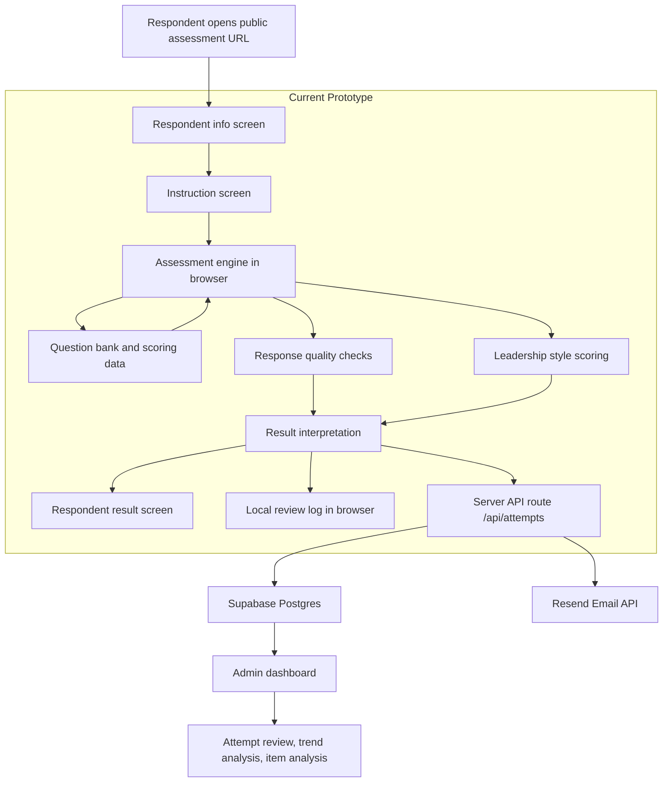
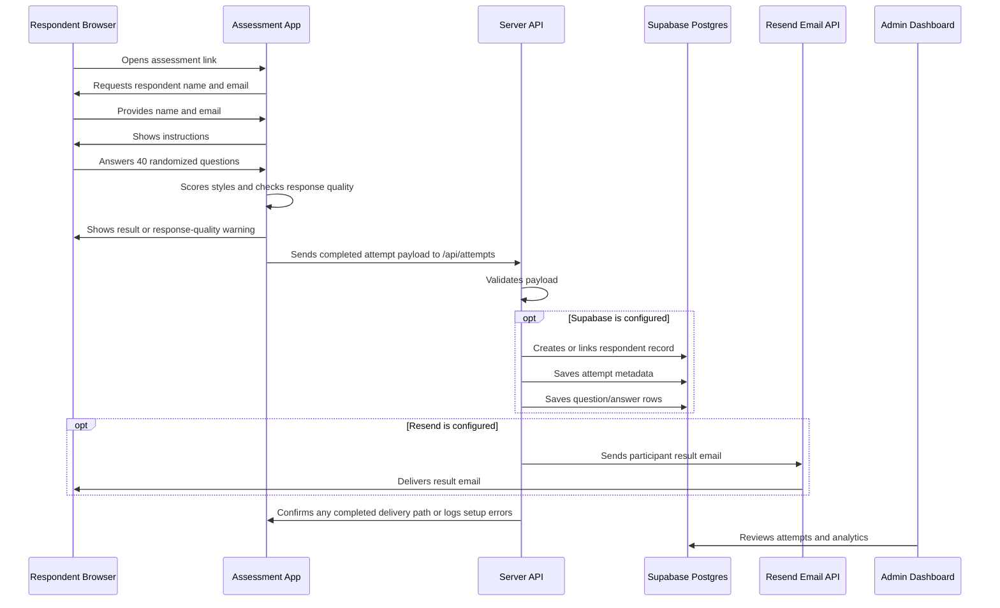
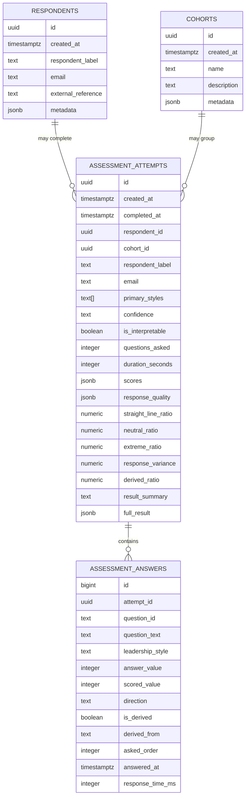

# Leadership Assessment Architecture Overview

## Executive Summary

This application is a research-informed leadership style self-assessment built from dissertation-derived leadership assessment materials. The current deployed prototype is a browser application hosted on Vercel. It uses JavaScript in the browser to present 40 randomized questions, score responses with weighted arithmetic, detect low-quality response patterns, generate respondent-facing results, save local review logs, and post completed attempts to a server-side API route for database persistence when configured.

The persistence architecture uses a Vercel serverless function and Supabase Postgres so every completed attempt can be reviewed by the owner and analyzed over time once the required environment variables and database schema are configured.

## Current Deployment

- Public URL: `https://2-0-leadership.vercel.app`
- Source control: GitHub repository `campojo/2.0_Leadership`
- Hosting: Vercel deployment
- Runtime: Browser JavaScript
- Persistence today: Browser `localStorage` plus `/api/attempts` database save route
- Permanent database: Supabase Postgres once configured in Vercel

## Current Tech Stack

| Layer | Current Choice | Purpose |
| --- | --- | --- |
| Markup | HTML | App structure and content |
| Styling | CSS | Responsive UI, assessment layout, result cards |
| Logic | Vanilla JavaScript | Assessment engine, weighted scoring, response quality checks |
| Data | JSON + JavaScript data bundle | Extracted leadership question bank and result descriptions |
| Hosting | Vercel | Public shareable URL |
| API | Vercel serverless function | Server-side attempt saving without exposing database credentials |
| Source Control | GitHub | Versioning and Vercel deployment source |
| Local Persistence | `localStorage` | Backup saved attempts and debug review logs |
| Database Persistence | Supabase Postgres | Permanent attempts, answers, scores, and review records |

## Production Stack Target

| Layer | Recommended Choice | Purpose |
| --- | --- | --- |
| Frontend + Server | Vercel static frontend plus serverless API, later Next.js if admin UI grows | Public assessment, API routes, admin UI |
| Database | Supabase Postgres | Permanent assessment attempts, answers, scores, admin analytics |
| Auth | Supabase Auth or equivalent | Admin-only access |
| API | Server-side routes | Validate and save attempts without exposing privileged database keys |
| Analytics | Admin dashboard | Aggregate trends, response-quality monitoring, respondent history |

## Architecture Diagram



## Database Save Flow



## Source Data Pipeline

The source materials were provided as spreadsheets and PDF exports. The active prototype uses an extracted JSON data file:

- `data/leadership-assessment.json`
- `data/leadership-assessment.js`

These contain:

- Leadership styles
- Question bank
- High/moderate/low result descriptions
- Style qualities
- Style-help transition content

The active app uses the original imported question set. No corrected, derived, reverse-framed, or contrast questions are active in the current production assessment.

The original working source files were intentionally excluded from GitHub through `.gitignore` because they are local source materials, while the extracted app data is included for deployment.

## Leadership Framework

The active assessment covers eight leadership styles:

- Autocratic
- Democratic
- Laissez-Faire
- Transactional
- Transformational
- Servant
- Charismatic
- Situational

The framework is positioned as dissertation-derived and research-informed. It should not be described as clinically validated, diagnostic, scientifically proven, or peer-reviewed unless independent evidence is later provided.

Recommended language:

- `Based on doctoral research in leadership`
- `Research-informed leadership style assessment`
- `Designed from dissertation-derived leadership framework materials`

## Assessment Methodology

### Assessment Type

The assessment is a self-assessment. Questions are presented in first person wherever possible to avoid confusion.

### Question Count

The assessment asks exactly 40 scored questions.

The design goal is to use the full question allowance so each leadership style receives equal coverage and scoring is less dependent on a small number of broadly agreeable items.

### Randomization

Questions are randomized so respondents do not receive all questions from one leadership style together.

The question’s leadership style is hidden while the respondent answers to reduce obvious response gaming.

### Minimum Coverage

The baseline phase asks questions across all eight leadership styles. The required baseline is five randomized questions per style, for 40 total items.

All baseline questions come from the original imported source question pool.

### Administration Model

The current production flow uses the full 40-question baseline and does not stop early.

The app randomly selects five questions from each leadership style and interleaves those questions so the respondent does not receive style blocks.

The result may include two equally likely styles only when exactly two styles tie for the highest weighted sum. It never returns more than two primary styles.

### Scoring

Responses use a five-point Likert scale:

- Strongly Disagree
- Disagree
- Neutral
- Agree
- Strongly Agree

Responses are converted to weighted values:

- Strongly Disagree: `-3`
- Disagree: `-1`
- Neutral: `0`
- Agree: `1`
- Strongly Agree: `3`

Each style receives five questions. The style strength is the sum of those five weighted answers, giving each style a possible range from `-15` to `15`.

Scores are not normalized because each style receives the same number of questions.

Negative-direction items reverse the weighted value.

Respondents do not see raw numerical totals. The result screen uses a leadership map, a profile concentration badge, and text labels:

- Low correlation
- Low tendency
- Moderate tendency
- High tendency
- Strong tendency

## Response Quality Methodology

The app detects low-quality or non-interpretable answer patterns without accusing the respondent.

Current checks include:

- Straight-lining: one answer option used for 85%+ of answers.
- Very low response variance.
- Mostly neutral responses.
- Heavy extreme-answer pattern with little variation.
If a response pattern is not interpretable because of straight-lining, very low variation, mostly neutral responses, or an extreme one-option response pattern, the attempt is saved, but the app shows `No Leadership Style Assigned` instead of presenting a leadership style as meaningful.

## Respondent Experience

1. Respondent opens the public URL.
2. Respondent enters their name and email.
3. Respondent reads an instruction screen.
4. Respondent answers randomized self-assessment questions.
5. Respondent may go back and review previous questions.
6. The app preserves answers when reviewing.
7. The app computes weighted style strengths and response-quality flags.
8. Respondent receives one assigned style, two assigned styles, or a no-classification result only if the response pattern is not interpretable.

## Current Review Logs

The prototype includes a local review log in the browser.

After a completed assessment, the reviewer can inspect:

- Saved attempts in that browser.
- Exact questions shown.
- Answers selected.
- Scored values for debugging.
- Original source question status.
- Style strength labels and response-quality labels.

This is a temporary debugging feature until permanent database persistence is connected.

## Admin Panel Direction

The admin panel should be private and separate from the public assessment.

Planned admin capabilities:

- Review all attempts.
- Inspect question/answer logs.
- Track response-quality patterns.
- See style score distributions.
- Track individual trends over time.
- Analyze aggregate trends by date, group, or respondent label.
- Identify confusing or low-discrimination questions.

Admin-only metrics should include:

- Primary style distribution.
- Average weighted strength by style.
- Strength spread by style.
- Tie frequency.
- Invalid/needs-review attempt rate.
- Completion length.
- Answer distribution across Likert options.
- Straight-line ratio.
- Neutral ratio.
- Extreme response ratio.
- Response variance.
- Item-total correlation once enough data exists.

## Planned Database Storage

The planned database is Supabase Postgres. The design stores both normalized records for analytics and a full JSON payload for auditability.

Core tables:

- `respondents`
- `cohorts`
- `assessment_attempts`
- `assessment_answers`

The schema is documented in `DATABASE_SCHEMA.sql`.

### Entity Relationship Diagram



### Table Responsibilities

`respondents`

Stores respondent identity or labels. The prototype requires name and email so repeated attempts and emailed results can be tied to the same person.

This table enables repeated attempts to be tied back to the same person over time. The app can still support anonymous or partially identified attempts if a specific deployment requires it.

`cohorts`

Stores optional grouping information, such as a workshop, client organization, team, leadership program, assessment batch, or class. This enables cohort-level trend reporting.

`assessment_attempts`

Stores one completed assessment attempt. This is the primary admin row for reporting. It stores summary fields such as primary style, interpretability, weighted score JSON, response-quality metrics, result text, and the full app payload.

`assessment_answers`

Stores one row per answered question. This enables full audit trails, exact question review, answer review, item analysis, and question-level statistics.

### Why Use Both Columns And JSON

The database stores important analytics fields as first-class columns and also stores the full result payload as JSON.

First-class columns make admin analytics easier:

- `is_interpretable`
- `questions_asked`
- `straight_line_ratio`
- `neutral_ratio`
- `extreme_ratio`
- `response_variance`

The `full_result` JSON keeps the exact historical result generated by the app, which is useful for debugging, audit trails, and future migrations.

### What Gets Stored Per Attempt

Each attempt stores:

- Attempt id
- Timestamp
- Optional respondent id
- Respondent label/name
- Email through linked respondent record
- Optional cohort id
- Primary style or two-style tie
- Response-quality status
- Whether the result is interpretable
- Per-style scores
- Response-quality flags
- Response-quality metrics
- Result text
- Full result payload

Each answer stores:

- Attempt id
- Question id
- Question text shown
- Leadership style
- Answer value
- Scored value
- Scoring direction
- Whether the question came from the original source pool
- Question order
- Optional response timing once implemented

### Analytics Enabled By This Storage Model

This storage model supports:

- All attempts over time.
- All attempts for one respondent.
- All attempts inside a cohort.
- Aggregate leadership-style distribution.
- Score trends by style.
- Invalid or needs-review attempt rates.
- Straight-line, neutral, and extreme answer rates.
- Question-level answer distributions.
- Item-level variance.
- Item-total correlations once enough data exists.
- Longitudinal respondent changes over repeated attempts.

## Security And Privacy

Public respondents should only access:

- The assessment
- Their immediate result

Admin analytics must require authentication.

The browser should not write directly to the database with privileged credentials. Completed attempts should be sent to a server-side API route, validated there, and then written to Supabase using secure server-side credentials.

## Repository File Map

| File | Purpose |
| --- | --- |
| `index.html` | App structure and screens |
| `styles.css` | Responsive UI and visual styling |
| `app.js` | Assessment engine, scoring, result rendering, local review logs |
| `api/attempts.js` | Vercel serverless route that validates attempts, saves to Supabase when configured, and emails results when configured |
| `data/leadership-assessment.json` | Extracted assessment data |
| `data/leadership-assessment.js` | Browser-loadable assessment data |
| `QUESTION_BANK_REVIEW.md` | Human-readable inventory of every active question, category, direction, provenance, and selection status |
| `ASSESSMENT_DESIGN.md` | Detailed assessment design decisions |
| `ADMIN_ANALYTICS_PLAN.md` | Admin panel and analytics roadmap |
| `PERSISTENCE_PLAN.md` | Database persistence plan |
| `DATABASE_SCHEMA.sql` | Supabase/Postgres schema for permanent attempt storage |
| `SUPABASE_VERIFY.sql` | Supabase SQL checks for stored respondents, attempts, and answers |
| `SUPABASE_SETUP.md` | Step-by-step Supabase and Vercel environment setup |
| `benchmark/respondents.json` | Synthetic respondent fixture for scoring regression testing |
| `benchmark/run-benchmark.js` | Node benchmark runner that loads the current app scoring code |
| `benchmark/export-question-bank.js` | Regenerates the active question-bank review from the current app code |

## Benchmark Workflow

Run the scoring benchmark after any scoring, question-selection, or classification update:

```bash
node benchmark/run-benchmark.js
```

The benchmark uses 15 controlled synthetic respondent patterns to confirm that clear single-style cases, dual-style cases, broad high-scoring cases, neutral cases, and low-quality response patterns still behave as expected.

## Current Limitations

- Permanent database saves require a Supabase project and Vercel environment variables.
- Supabase server-side API access supports the newer `sb_secret_` secret key and legacy `service_role` key, both stored only in Vercel.
- Result emails require Resend environment variables.
- Admin analytics are planned but not yet implemented.
- Local review logs exist only in the browser that completed the assessment.
- Respondent name and email are required.
- No authentication exists yet for admin-only views.
- Timing metrics are not yet collected.

## Recommended Next Build Steps

1. Configure Resend and add `RESEND_API_KEY` plus `RESULT_EMAIL_FROM` to Vercel if participant result emails are needed first.
2. Create a Supabase project.
3. Apply `DATABASE_SCHEMA.sql`.
4. Add `SUPABASE_URL` and `SUPABASE_SERVICE_ROLE_KEY` to Vercel environment variables.
5. Redeploy the Vercel project.
6. Complete a test assessment and verify the result email plus rows in `respondents`, `assessment_attempts`, and `assessment_answers`.
7. Run `node benchmark/run-benchmark.js` before releasing scoring changes.
8. Add admin authentication.
9. Build the admin attempts table.
10. Build the admin analytics dashboard.
