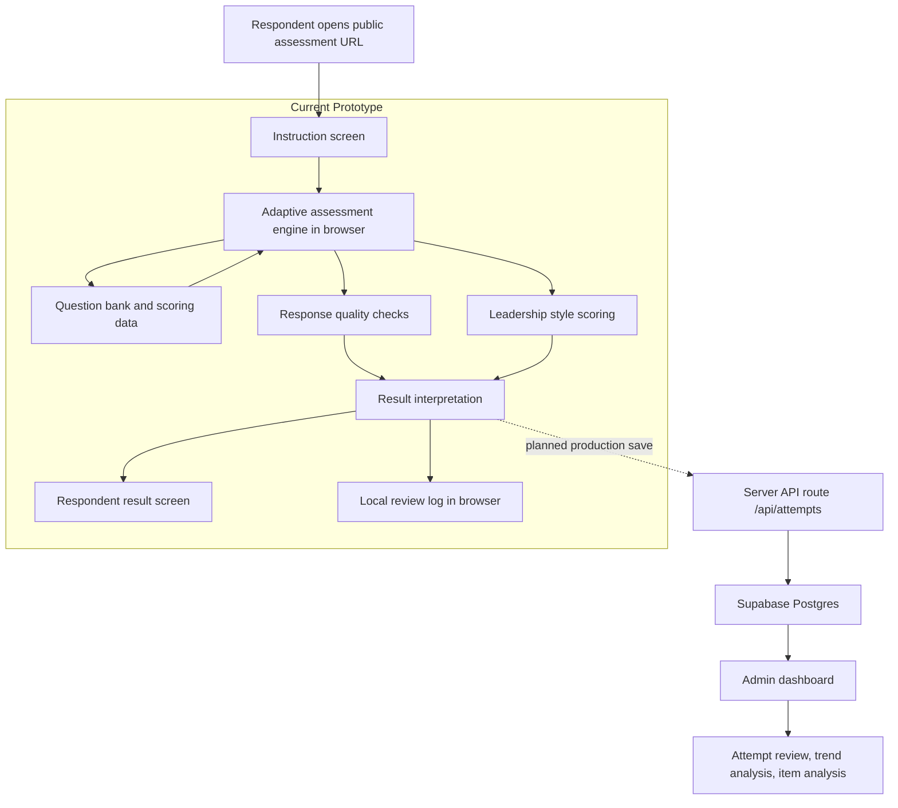
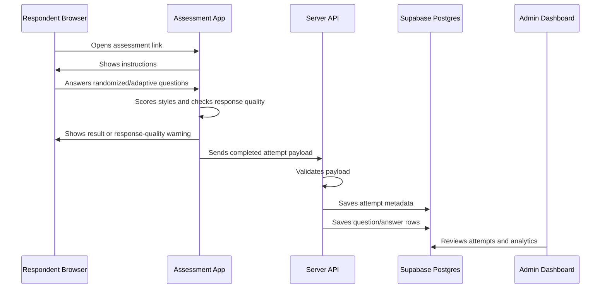

# Leadership Assessment Architecture Overview

## Executive Summary

This application is a research-informed leadership style self-assessment built from dissertation-derived leadership assessment materials. The current deployed prototype is a static browser application hosted on Vercel. It uses JavaScript in the browser to present randomized and adaptive questions, score responses, detect low-quality response patterns, generate respondent-facing results, and save local review logs.

The next production architecture adds a server-side application layer and a persistent database so every completed attempt can be reviewed by an authenticated admin and analyzed over time.

## Current Deployment

- Public URL: `https://2-0-leadership.vercel.app`
- Source control: GitHub repository `campojo/2.0_Leadership`
- Hosting: Vercel static deployment
- Runtime: Browser JavaScript
- Persistence today: Browser `localStorage`
- Permanent database: planned, not yet connected

## Current Tech Stack

| Layer | Current Choice | Purpose |
| --- | --- | --- |
| Markup | HTML | App structure and content |
| Styling | CSS | Responsive UI, assessment layout, result cards |
| Logic | Vanilla JavaScript | Adaptive assessment engine, scoring, response quality checks |
| Data | JSON + JavaScript data bundle | Extracted leadership question bank and result descriptions |
| Hosting | Vercel | Public shareable URL |
| Source Control | GitHub | Versioning and Vercel deployment source |
| Local Persistence | `localStorage` | Temporary saved attempts and debug review logs |

## Planned Production Stack

| Layer | Recommended Choice | Purpose |
| --- | --- | --- |
| Frontend + Server | Next.js on Vercel | Public assessment, API routes, admin UI |
| Database | Supabase Postgres | Permanent assessment attempts, answers, scores, admin analytics |
| Auth | Supabase Auth or equivalent | Admin-only access |
| API | Server-side routes | Validate and save attempts without exposing privileged database keys |
| Analytics | Admin dashboard | Aggregate trends, response-quality monitoring, respondent history |

## Architecture Diagram

## Production Data Flow

## Source Data Pipeline

The source materials were provided as spreadsheets and PDF exports. The active prototype uses an extracted JSON data file:

- `data/leadership-assessment.json`
- `data/leadership-assessment.js`

These contain:

- Leadership styles
- Question bank
- High/moderate/low result descriptions
- Style qualities
- Style-help transition content

The original working source files were intentionally excluded from GitHub through `.gitignore` because they are local source materials, while the extracted app data is included for deployment.

## Leadership Framework

The active assessment covers eight leadership styles:

- Autocratic
- Democratic
- Laissez-Faire
- Transactional
- Transformational
- Servant
- Charismatic
- Situational

The framework is positioned as dissertation-derived and research-informed. It should not be described as clinically validated, diagnostic, scientifically proven, or peer-reviewed unless independent evidence is later provided.

Recommended language:

- `Based on doctoral research in leadership`
- `Research-informed leadership style assessment`
- `Designed from dissertation-derived leadership framework materials`

## Assessment Methodology

### Assessment Type

The assessment is a self-assessment. Questions are presented in first person wherever possible to avoid confusion.

### Question Count

The assessment asks no more than 40 scored questions.

The design goal is to stop earlier when the system has enough confidence to classify the respondent.

### Randomization

Questions are randomized so respondents do not receive all questions from one leadership style together.

The question’s leadership style is hidden while the respondent answers to reduce obvious response gaming.

### Minimum Coverage

The baseline phase asks questions across all eight leadership styles. The preferred baseline is two questions per style, for 16 initial items.

### Adaptive Questioning

After the baseline phase, the app asks follow-up questions only when they improve classification quality.

Follow-up questions are selected when:

- Leading styles are close.
- A style has internally inconsistent responses.
- The top style does not have enough separation from the second style.
- The system needs to distinguish between two plausible styles.

The result may include two equally likely styles, but never more than two.

### Scoring

Responses use a five-point Likert scale:

- Strongly Disagree
- Disagree
- Neutral
- Agree
- Strongly Agree

Style scores are normalized so styles can be compared even if adaptive questioning asks different numbers of questions per style.

Derived negative-framed questions are reverse-scored.

### Derived Items

Most questions come directly from the source question bank. A small number of negative-framed questions may be derived from the original constructs to support response-quality checks and reduce agreement bias.

Policy:

- Derived items preserve the original construct.
- Derived items should be traceable to a source question.
- Preferred target is 0-10% of asked questions.
- Hard ceiling is 25% of asked questions.
- Derived items are measurement safeguards, not new leadership theory.

## Response Quality Methodology

The app detects low-quality or non-interpretable answer patterns without accusing the respondent.

Current checks include:

- Straight-lining: one answer option used for 85%+ of answers.
- Very low response variance.
- Mostly neutral responses.
- Heavy extreme-answer pattern with little variation.
- Derived-question ratio.

If a response pattern is not interpretable, the respondent is allowed to finish and the attempt is saved, but the app shows `Result Needs Review` instead of presenting a leadership style as meaningful.

## Respondent Experience

1. Respondent opens the public URL.
2. Respondent reads an instruction screen.
3. Respondent answers randomized self-assessment questions.
4. Respondent may go back and review previous questions.
5. The app preserves answers when reviewing.
6. The app computes style scores and response-quality flags.
7. Respondent receives a result, or a response-quality warning if the pattern is not interpretable.

## Current Review Logs

The prototype includes a local review log in the browser.

After a completed assessment, the reviewer can inspect:

- Saved attempts in that browser.
- Exact questions shown.
- Answers selected.
- Scored values.
- Source vs derived question status.
- Style scores and confidence labels.

This is a temporary debugging feature until permanent database persistence is connected.

## Admin Panel Direction

The admin panel should be private and separate from the public assessment.

Planned admin capabilities:

- Review all attempts.
- Inspect question/answer logs.
- Track response-quality patterns.
- See style score distributions.
- Track individual trends over time.
- Analyze aggregate trends by date, group, or respondent label.
- Identify confusing or low-discrimination questions.

Admin-only metrics should include:

- Primary style distribution.
- Average score by style.
- Score spread by style.
- Tie frequency.
- Confidence distribution.
- Invalid/needs-review attempt rate.
- Completion length.
- Answer distribution across Likert options.
- Straight-line ratio.
- Neutral ratio.
- Extreme response ratio.
- Response variance.
- Item-total correlation once enough data exists.

## Planned Database Schema

The current planned database is Supabase Postgres with two core tables:

- `assessment_attempts`
- `assessment_answers`

The schema is documented in `DATABASE_SCHEMA.sql`.

Each attempt stores:

- Attempt id
- Timestamp
- Primary style or two-style tie
- Confidence level
- Per-style scores
- Response-quality flags
- Result text
- Full result payload

Each answer stores:

- Attempt id
- Question id
- Question text shown
- Leadership style
- Answer value
- Scored value
- Scoring direction
- Whether the question was source-based or derived
- Question order

## Security And Privacy

Public respondents should only access:

- The assessment
- Their immediate result

Admin analytics must require authentication.

The browser should not write directly to the database with privileged credentials. Completed attempts should be sent to a server-side API route, validated there, and then written to Supabase using secure server-side credentials.

## Repository File Map

| File | Purpose |
| --- | --- |
| `index.html` | App structure and screens |
| `styles.css` | Responsive UI and visual styling |
| `app.js` | Assessment engine, scoring, result rendering, local review logs |
| `data/leadership-assessment.json` | Extracted assessment data |
| `data/leadership-assessment.js` | Browser-loadable assessment data |
| `ASSESSMENT_DESIGN.md` | Detailed assessment design decisions |
| `ADMIN_ANALYTICS_PLAN.md` | Admin panel and analytics roadmap |
| `PERSISTENCE_PLAN.md` | Database persistence plan |
| `DATABASE_SCHEMA.sql` | Planned Supabase/Postgres schema |

## Current Limitations

- Results are not yet saved to a permanent database.
- Admin analytics are planned but not yet implemented.
- Local review logs exist only in the browser that completed the assessment.
- No respondent identity capture exists yet.
- No authentication exists yet for admin-only views.
- Timing metrics are not yet collected.

## Recommended Next Build Steps

1. Convert the static prototype to a server-capable app, preferably Next.js on Vercel.
2. Create a Supabase project.
3. Apply `DATABASE_SCHEMA.sql`.
4. Add a secure `/api/attempts` endpoint.
5. Persist every completed attempt and answer row.
6. Add admin authentication.
7. Build the admin attempts table.
8. Build the admin analytics dashboard.
9. Add respondent identifiers if longitudinal tracking is required.
